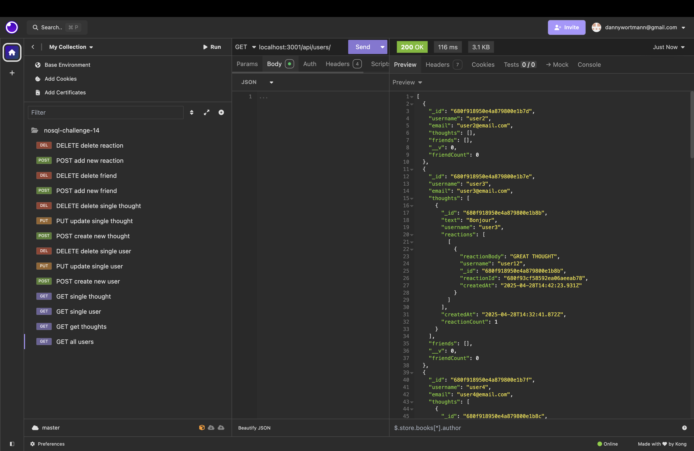

# Social Network API Challenge

## Table of Contents

 * [Description](#description)
 * [Installation](#installation)
 * [Usage Information](#usage-information)
 * [Contribution Guidelines](#contribution-guidelines)
 * [Credits](#credits)
 * [License](#license)
 * [Questions](#questions)

## Description
This project built an API to be used for a simple social network application using Express.js, a MonoDB Database, and the Mongoose ODM. This was my first project using a NoSQL database and creating an entire API from the scratch. This project only created the back-end of the application; a future development goal is to complete it by adding a client side and get it deployed.

## Live URL

[Link to Walkthrough Video](https://drive.google.com/file/d/1kWOO-p_Q8hXy_nQZM0447YwSI1pyR2CD/view?usp=drive_link)

## Installation
1. Clone the repo onto your machine using the command "git clone" using the SSH key from the repository.
2. Open respository in VS code (download this if necessary). 
3. Install necessary packages by running "npm install". 
4. Build application by running "npm run build" followed by "npm run seed" to get seed data.
5. Run "npm start" to get the server running on port 3001.

## Usage Information
Once server is running, Insomnia can be used to test routes for getting, updating, posting, and deleting data on the social network application.

## Contribution Guidelines
I am open to collaborations. Any changes should made on a feature branch and pull requests will need to be reviewed before being added to the main branch.

## Credits
My TA Allan assisted in working out some errors I was getting when trying to seed the data and making sure my routes were working correctly . The Xpert Learning Assistant on BootCampSpot was able to suggest solutions for other issues in the application.

## License
This application is covered under the [MIT License](https://opensource.org/licenses/MIT).

## Questions?
Follow the link below to see my Github account and additional respositories. Click on my email address to send me a message if you have any questions!

[Link to Github](http://github.com/dlwortmann)

<a href="mailto:dannywortmann@gmail.com">dannywortmann@gmail.com</a>

